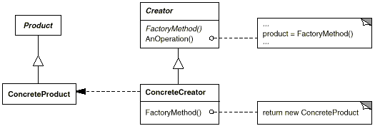

# Factory Method

## Propósito
Padrão de Criação

## Escopo
Classe

## Intenção
Definir uma interface para criar um objeto, mas deixar as subclasses decidirem que classe instanciar. O Factory Method permite adiar a instanciação para subclasses.

## Estrutura

## Participantes

### Product
Define a interface de objetos que o método fábrica cria.

- [MapSite](./maze.py#ProductMapSite)

### ConcreteProduct
Implementa a interface de **Product**

- [Room](./maze.py#ConcreteProductRoom)
- [Wall](./maze.py#ConcreteProductWall)
- [Door](./maze.py#ConcreteProductDoor)

- [RoomWithABomb](./bombed_maze_game.py#ConcreteProductRoomWithABomb)
- [BombedWall](./bombed_maze_game.py#ConcreteProductBombedWall)

- [EnchantedRoom](./enchanted_maze_game.py#ConcreteProductEnchantedRoom)
- [DoorNeedingSpell](./enchanted_maze_game.py#ConcreteProductDoorNeedingSpell)

### Creator
Declara o método fábrica, o qual retorna um objeto do tipo **Product**. Creator pode também definir uma implementação por omissão do método factory que retorna por omissão um objeto **ConcreteProduct**

Pode chamar o método factory para criar um objeto **Product**

- [MazeGame](./maze_game.py#CreatorMazeGame)

### ConcreteCreator
Redefine o método-fábrica para retornar a uma instância de um **ConcreteProduct**

- [BombedMazeGame](./bombed_maze_game.py#ConcreteCreatorBombedMazeGame)
- [EnchantedMazeGame](./enchanted_maze_game.py#ConcreteCreatorEnchantedMazeGame)